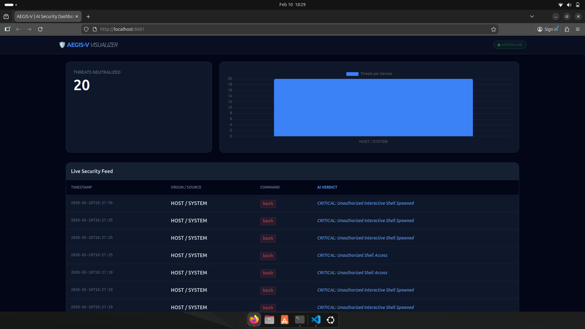
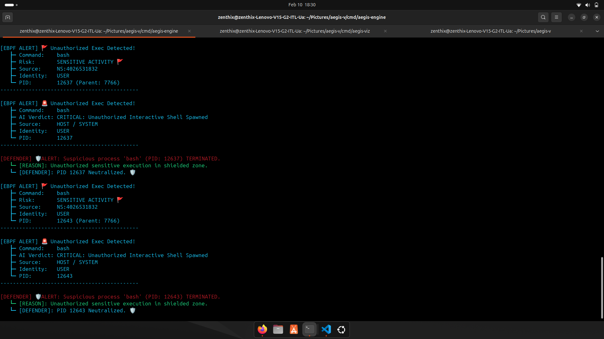
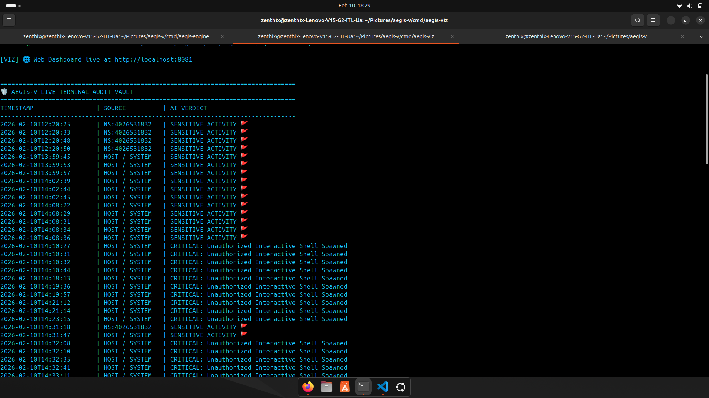
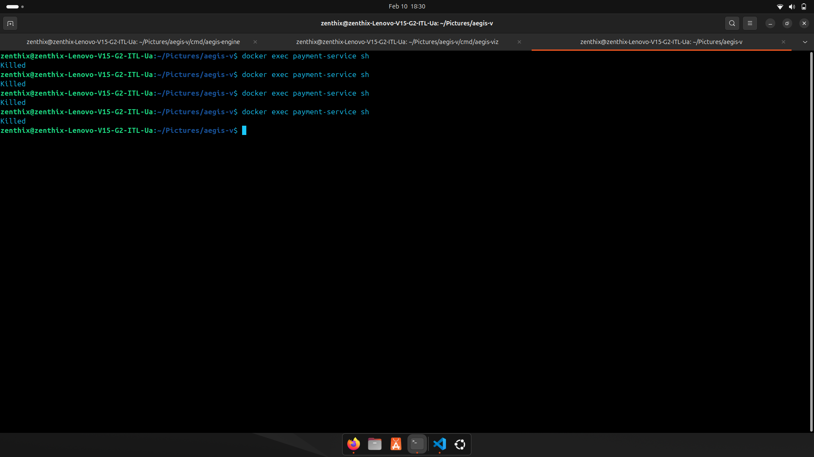
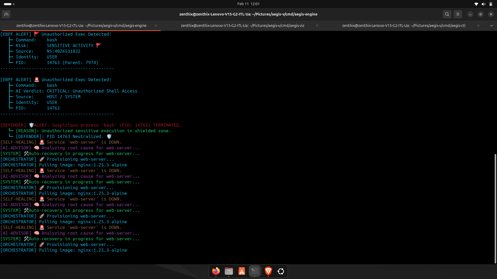
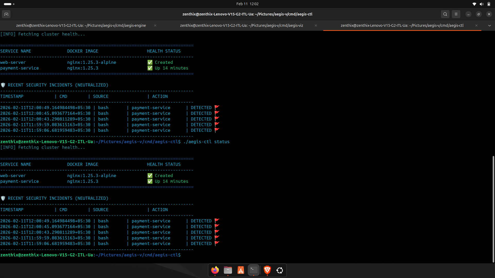
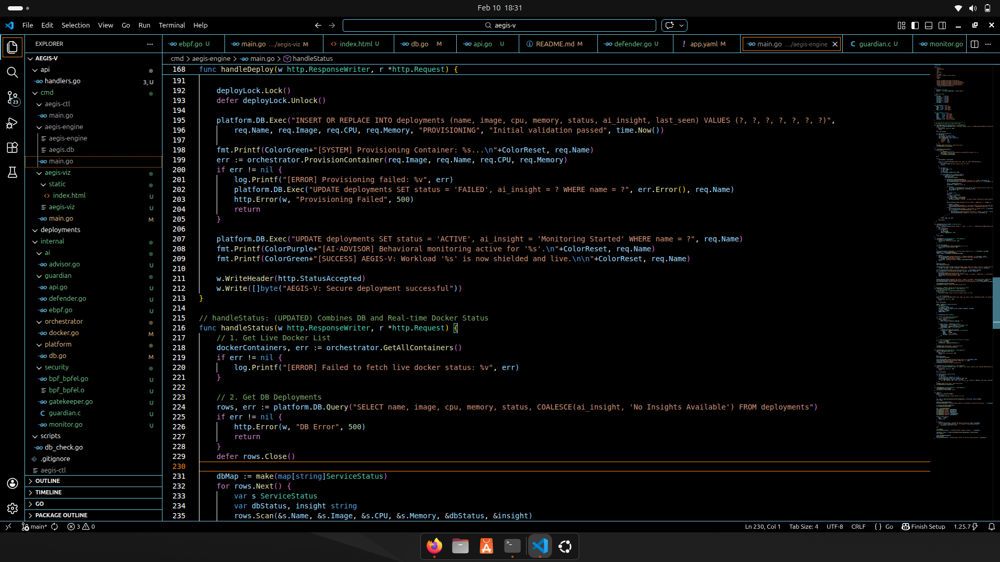

# 🛡️ AEGIS-V

A lightweight container runtime security system with integrated deployment and automated recovery — Docker-based, single-node.

AEGIS-V explores how security and container lifecycle management can be integrated into a single control loop, rather than bolted on as a separate layer. It validates workloads before they start, monitors process execution at the kernel level while they run, and automatically heals or quarantines containers when something goes wrong.

```
Deploy → Enforce → Monitor → Respond → Recover
```

---

## 🧭 What Makes This Different

Most runtime security tools are observation layers — they sit beside your infrastructure, detect events, and alert. Deployment, recovery, and response remain someone else's job.

AEGIS-V integrates all of that into one system:

| Capability | AEGIS-V | Typical Security Monitor |
|---|---|---|
| Deploys containers | ✅ Yes | ❌ No |
| Supply-chain policy at deploy time | ✅ Yes | ❌ No |
| eBPF runtime monitoring | ✅ Yes | ✅ Yes |
| Active process termination | ✅ Yes | Sometimes |
| Self-healing with security context | ✅ Yes | ❌ No |
| Requires Kubernetes | ❌ No | Usually yes |

> For Kubernetes-native runtime detection, see [KubeRTSec](https://github.com/Debasish-87/kubertsec) — a separate project that runs as a DaemonSet across a cluster. AEGIS-V is a single-node system that owns the full container lifecycle.

---

## ⚙️ Core Components

### AEGIS-ENGINE — Control Layer (`localhost:8080`)

Runs the full control loop in a single binary:

- **Gatekeeper** — validates workload specs before any container is provisioned
- **Orchestrator** — pulls images, creates containers, applies CPU/memory limits
- **eBPF Monitor** — attaches to `sys_enter_execve`; captures process executions across all containers
- **Rule-Based Advisor** — classifies threats and informs recovery decisions
- **Reconciliation Loop** — every ~15 seconds, compares desired state (DB) against actual state (Docker) and acts
- **SQLite persistence** (`aegis.db`) — stores deployments, detections, and security alerts

Endpoints: `/deploy` · `/status` · `/alerts` · `/delete` · `/health` · `/api/logs`

---

### AEGIS-CTL — CLI

```bash
./aegis-ctl <workload.yaml>         # Deploy a workload
./aegis-ctl status                  # Services + active incidents
./aegis-ctl alerts                  # Detection history from DB
./aegis-ctl delete <service-name>   # Remove a workload
./aegis-ctl help
```

---

### AEGIS-VIZ — Dashboard (`localhost:8081`)

- Live security event stream (auto-refresh polling)
- Threat count and bar chart (Chart.js)
- Source-wise attack visualization
- Real-time audit feed

---

## 🔁 System Flows

### Deploy Flow

```
aegis-ctl <yaml>
      │
      ▼
POST /deploy
      │
      ▼
Gatekeeper checks workload spec
  • blocks :latest and untagged images
  • validates registry against allowlist
  • scans for blacklisted keywords
  • rejects malformed image references
      │
  Passed?
  ┌───┴───┐
 YES      NO → rejected with reason
  │
  ▼
Orchestrator provisions container
(image pull · CPU/MEM limits · start)
      │
      ▼
State written to SQLite
```

### Runtime Detection Flow

```
Process executes inside container
      │
      ▼
eBPF captures execve syscall
(pid · ppid · uid · mount_ns · comm)
      │
      ▼
Kernel-side noise filter removes
known-safe procs (systemd · dockerd · AEGIS internals)
      │
      ▼
Userspace: mount namespace → container name resolved
      │
      ▼
Rule-based advisor classifies event
assigns severity: LOW / MEDIUM / HIGH / CRITICAL
      │
      ▼
Detection stored in SQLite → dashboard updated
      │
(If HIGH/CRITICAL) Defender sends SIGKILL
  guarded by: whitelist · parent-chain check · system PID range check
```

### Self-Healing Flow

```
Reconciliation loop (~15s interval)
      │
      ▼
DB desired state vs. live Docker state
      │
  Drift detected?
  ┌────┴────┐
 YES        NO → continue
  │
  ▼
Advisor checks recent detections for this container
      │
  Crash only?      Security incident?
      │                    │
   Restart            Quarantine
                    (block restart)
```

---

## 🧠 Architecture

```
                  ┌─────────────────────────────────────┐
                  │           AEGIS-CTL (CLI)           │
                  │  Deploy · Status · Alerts · Delete  │
                  └──────────────────┬──────────────────┘
                                     │ HTTP
                                                             ▼

┌────────────────────────────────────────────────────────────────────────────┐
│                          AEGIS-ENGINE  (:8080)                             │
│                                                                            │
│  ┌─────────────────────┐  ┌─────────────────────┐  ┌────────────────────┐  │
│  │     Gatekeeper      │  │    Orchestrator     │  │  Rule-Based        │  │
│  │  (Supply Chain)     │  │  (Docker Runtime)   │  │  Advisor           │  │
│  │  blocks :latest     │  │  pull image         │  │  threat classify   │  │
│  │  registry allow     │  │  create container   │  │  severity mapping  │  │
│  │  keyword scan       │  │  CPU/MEM limits     │  │  recovery decision │  │
│  └──────────┬──────────┘  └──────────┬──────────┘  └────────┬───────────┘  │
│             └────────────────────────┴──────────────────────┘              │
│                                                                            │
│──────────────────── Runtime Monitoring (Kernel Layer) ─────────────────────│
│                                                                            │
│  ┌──────────────────────────────────────────────────────────────────────┐  │
│  │  Guardian + eBPF Monitor                                             │  │
│  │  tracepoint: sys_enter_execve                                        │  │
│  │  captures: pid · ppid · uid · mount_ns · comm                        │  │
│  │  resolves: namespace → container name                                │  │
│  │  filters:  system procs + AEGIS internals                            │  │
│  │  defense:  SIGKILL guarded by whitelist + parent-chain checks        │  │
│  └──────────────────────────────────────────────────────────────────────┘  │
│                                                                            │
│                       SQLite  (aegis.db)                                   │
│           deployments · detections · security_alerts                       │
└────────────────────────────────────────────────────────────────────────────┘
                                     │
                                                             ▼

                  ┌─────────────────────────────────────┐
                  │           AEGIS-VIZ  (:8081)        │
                  │  Live Feed · Threat Charts · Audit  │
                  └─────────────────────────────────────┘
```

---

## 🔒 Security Capabilities

### Supply-Chain Gatekeeper
Workload policy is enforced before any container is created — untagged images, unrecognized registries, blacklisted keywords, and malformed references are all caught at deploy time.

### eBPF Exec Monitoring
Hooks `tracepoint/syscalls/sys_enter_execve`. Captures every process execution across all containers at the kernel level. Requires no application changes or sidecars.

### Noise Filtering
Known-safe processes are suppressed at both kernel and userspace levels — systemd, dockerd, containerd, Go toolchain, VS Code internals, and all AEGIS-own processes — so only relevant events surface.

### Rule-Based Threat Classification
Detects patterns including:
- Sensitive file access (`/etc/shadow`, `/etc/passwd`)
- Reverse shells (netcat, bash `-i`, python `-c`)
- Malware ingress (wget, curl with suspicious args)
- Crypto miner signatures (xmrig, minerd)
- Recon tools (nmap, tcpdump, lsof)

### Safe Process Termination
The Defender sends SIGKILL with three layers of protection: system PID range check, named process whitelist, and parent-chain traversal to prevent killing the engine or its children.

### Security-Informed Recovery
The reconciliation loop checks recent detections before deciding how to handle a downed container. A crash with no alerts triggers a restart; a crash following a HIGH or CRITICAL detection triggers quarantine.

---

## 🧠 Key Design Decisions

| Decision | Rationale |
|---|---|
| Integrate orchestration and security | Removes the gap between what is deployed and what is monitored |
| Gatekeeper at deploy time | Blocking bad workloads before they start is cheaper than detecting and killing them at runtime |
| eBPF over log parsing | Real-time kernel visibility without application instrumentation or log delay |
| Rule-based classification (not ML) | Deterministic and explainable — behavior is auditable and predictable |
| Security context in reconciliation | Recovery decisions account for whether a security incident was involved, not just whether a crash occurred |
| Docker-first, no Kubernetes dependency | Keeps the system self-contained and runnable on a single Linux machine |
| SQLite with WAL mode | Zero external dependencies; handles concurrent reads and writes without a separate database process |

---

## 📂 Project Structure

```
aegis-v/
│
├── cmd/
│   ├── aegis-engine/       # Control layer — API, gatekeeper, orchestration, eBPF, reconciliation
│   │   └── main.go
│   ├── aegis-ctl/          # CLI — deploy, status, alerts, delete
│   │   └── main.go
│   └── aegis-viz/          # Dashboard — live feed, threat charts
│       ├── main.go
│       └── static/index.html
│
├── internal/
│   ├── ai/
│   │   └── advisor.go      # Rule-based threat classification, severity mapping, recovery decisions
│   ├── guardian/
│   │   ├── ebpf.go         # Alert pipeline: NS resolve, noise filter, DB write
│   │   ├── api.go          # Alerts API handler
│   │   └── defender.go     # SIGKILL with whitelist + parent-chain protection
│   ├── orchestrator/
│   │   └── docker.go       # Container lifecycle + namespace → container name mapping
│   ├── platform/
│   │   └── db.go           # SQLite schema, WAL mode, migration helpers
│   └── security/
│       ├── gatekeeper.go   # Supply-chain policy enforcement
│       ├── guardian.c      # eBPF C program — sys_enter_execve tracepoint
│       ├── monitor.go      # eBPF loader, ringbuf reader, whitelist suppression
│       ├── bpf_bpfel.go    # Generated Go bindings (bpf2go)
│       └── bpf_bpfel.o     # Compiled eBPF object
│
├── api/
│   └── handlers.go         # HTTP handlers — status aggregation, incidents
│
├── scripts/
│   └── db_check.go         # Dev helper — schema validation, stored incident inspection
│
├── deployments/
├── app.yaml · cluster.yaml · test-nginx.yaml · test-app.yaml
├── go.mod · go.sum
└── README.md
```

---
#  Screenshots

##  AEGIS-VIZ Dashboard


##  Engine Running


##  Sensitive Data Logs Detection


##  Isolated Attacker / Quarantine


##  Self-Healing Recovery


##  Whole System Status


##  CLI / Code View



---

## ⚙️ Requirements

- **OS:** Linux — mandatory (eBPF requires kernel tracepoint support)
- **Go:** 1.20+
- **Docker:** installed and running
- **Permissions:** root (required to attach eBPF tracepoint)

---

## 🚀 Running AEGIS-V

### Step 1 — Clean port state

```bash
sudo pkill -9 aegis-engine || true
sudo pkill -9 aegis-viz || true
sudo fuser -k 8080/tcp || true
sudo fuser -k 8081/tcp || true
```

### Step 2 — Start Engine (Terminal 1)

```bash
cd ~/Pictures/aegis-v/cmd/aegis-engine
go build -o aegis-engine .
sudo ./aegis-engine
```

### Step 3 — Start Dashboard (Terminal 2)

```bash
cd ~/Pictures/aegis-v/cmd/aegis-viz
go build -o aegis-viz .
./aegis-viz
# Open http://localhost:8081
```

### Step 4 — Build CLI (Terminal 3)

```bash
cd ~/Pictures/aegis-v/cmd/aegis-ctl
go build -o aegis-ctl .
```

**Deploy a workload:**

```bash
./cmd/aegis-ctl/aegis-ctl test-nginx.yaml
./cmd/aegis-ctl/aegis-ctl test-app.yaml
```

---

## 🧪 Attack Simulation

```bash
# Safe — no alert expected
ls && pwd && echo "AEGIS-V running"

# Sensitive file access — should alert HIGH/CRITICAL
sudo cat /etc/shadow

# Container exec attempt — should alert
docker exec -it <container-id> bash
```

---

## 🔧 Troubleshooting

**Port in use:**
```bash
sudo fuser -k 8080/tcp && sudo fuser -k 8081/tcp
```

**Docker API version mismatch:**
```bash
export DOCKER_API_VERSION=1.44
```

**Dashboard not updating:** Confirm engine on `:8080` and viz on `:8081`. Hard refresh: `Ctrl + Shift + R`

---

## ⚠️ Scope & Limitations

- **Single-node only** — no multi-host or distributed support
- **Docker-native** — not a Kubernetes controller (see [KubeRTSec](https://github.com/Debasish-87/kubertsec) for that)
- **Rule-based detection** — deterministic heuristics, not machine learning
- **Experimental system** — built for learning and research, not production deployment

---

## 🧭 Roadmap

- [ ] API authentication layer
- [ ] Prometheus metrics endpoint
- [ ] Container network isolation on quarantine
- [ ] Signed image verification (cosign)
- [ ] Multi-node cluster support

---

## 📌 Use Cases

- Exploring how container orchestration and runtime security can be unified in a single control loop
- eBPF learning and kernel-level monitoring experimentation
- Supply-chain policy enforcement prototyping
- DevSecOps lab demonstration

---

## 👤 Author

**Debasish-87**  
`22btics06@suiit.ac.in`
